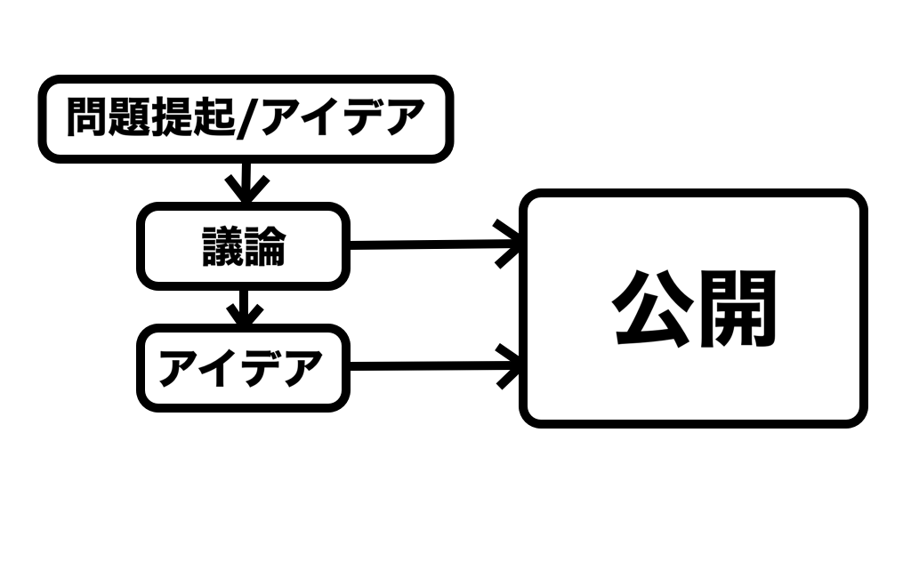

# ehime-idea-hub
アイデアを集約するサービス。  
GitHubのように、議論が出来る機能があって、誰かのアイデアに対して他の人たちがチームになってツッコミを入れていくようなサービスです。  
例えばプログラミング言語は絵や音楽やストーリーを繋ぐ役目を果たしています。  
そういった何かを繋ぐノリの役目になるアイデアがあって素敵なサービスが生まれるきっかけになればと思いました。  
## 流れ
 
このサービスを使う人たちのアイデアが固まったらgithub pagesのような形でウェブサイトを直接ホストすることが出来るような流れにしたいと思います。
## 必要な機能
・パーマリンク/ルーティング  
・データベース  
・画像アップロード  
